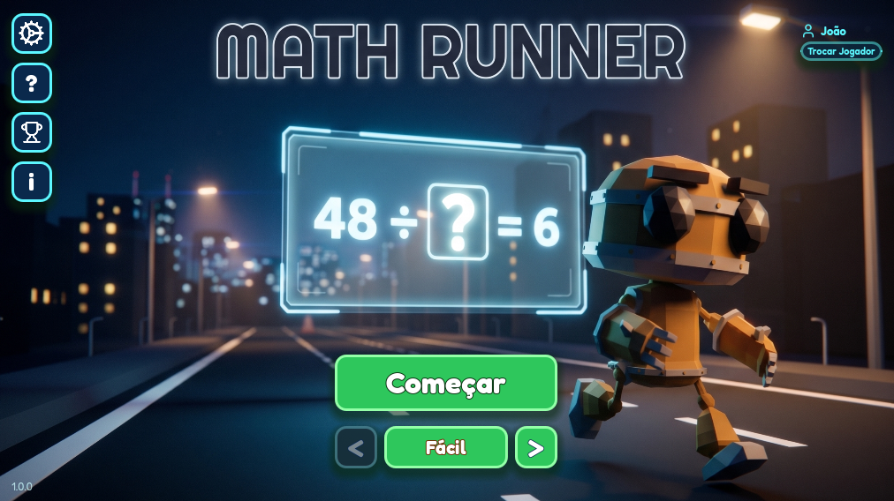
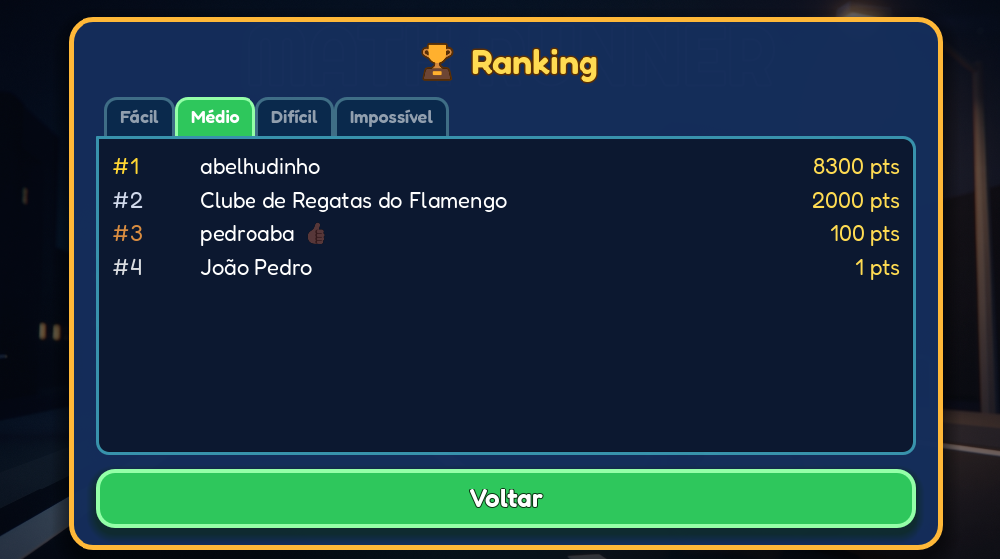
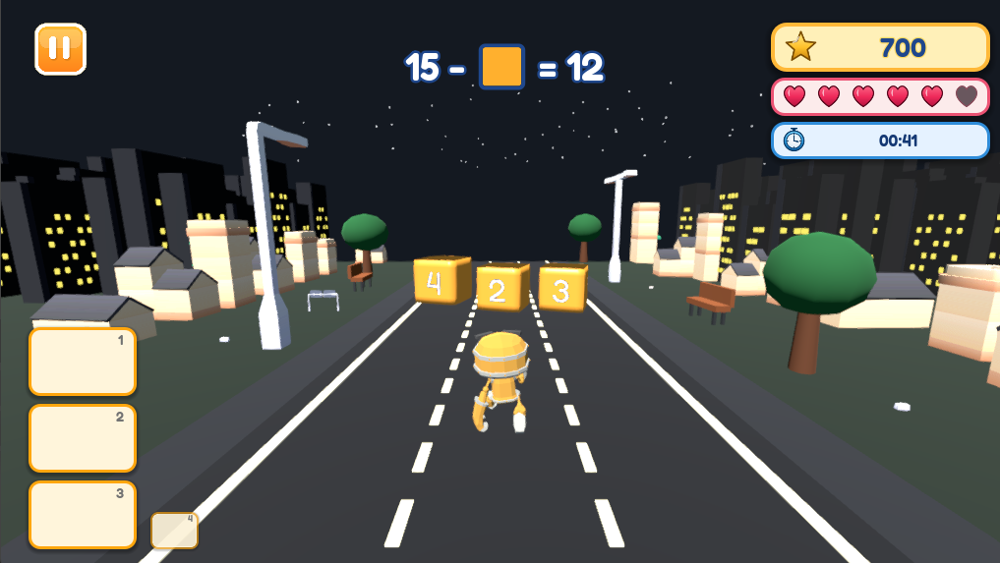
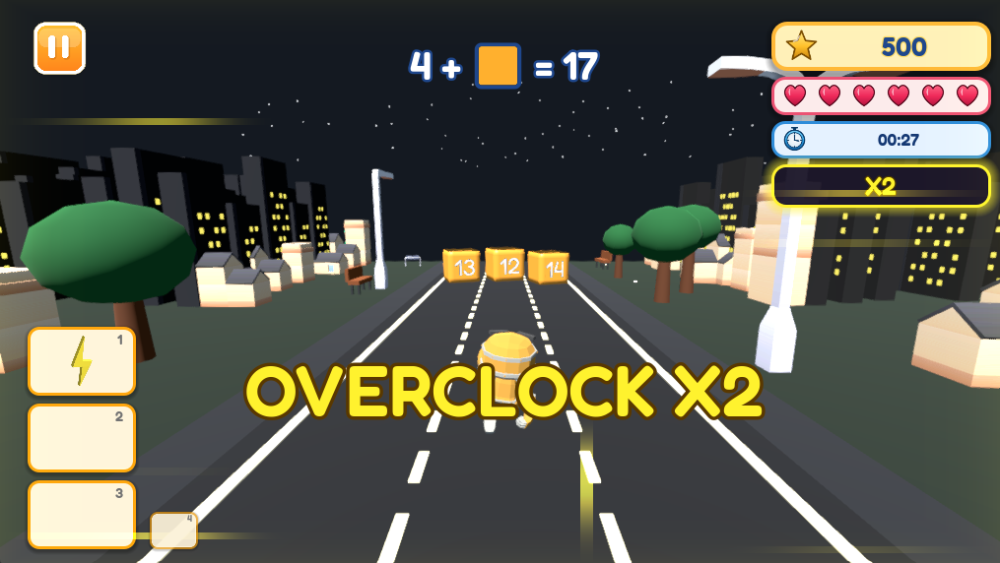

<div align="center">

# CPG_CTRL_Y - Math Runner

 
 

</div>

Jogo 3D educativo feito em Godot no estilo endless runner. O jogador controla um robô em três faixas, resolve equações escolhendo blocos de resposta, evita obstáculos, coleta power-ups e tenta alcançar a maior pontuação possível.

## Status do Projeto

**Projeto concluído.**

A versão atual está fechada como uma entrega completa do jogo, com ciclo principal, telas, persistência, ranking, áudio, assets, testes automatizados e preset de exportação para Windows.

Entrega final implementada:

- tela inicial com navegação para começar, ranking, ajuda, sobre e configurações;
- fluxo de identificação do jogador por nome;
- introdução antes da partida;
- jogo principal 3D com três pistas;
- geração de equações por dificuldade;
- blocos de resposta, obstáculos, power-ups, pontuação, combo, vidas e cronômetro;
- HUD completo com feedback visual, slots de power-up, overclock/combo e pausa;
- tela de fim de jogo com envio de pontuação;
- ranking por dificuldade via Supabase;
- persistência local de nome, recorde e preferências;
- tela de ajuda com power-ups, obstáculos e dificuldades;
- tela sobre com apresentação e créditos;
- áudio de menu, jogo, ações, impacto, bônus e derrota;
- suíte de testes GUT organizada por módulos;
- preset de exportação `Windows Desktop`.

Versão do projeto em `project.godot`:

```text
1.0.8
```

## Requisitos

- Godot 4.6 ou compatível com `config/features=PackedStringArray("4.6", "Forward Plus")`.
- Renderizador Forward Plus.
- Física 3D com Jolt Physics.
- Plugin GUT incluído em `addons/gut` para execução dos testes.

## Como Rodar

1. Abra o Godot.
2. Importe a pasta do projeto.
3. Abra `project.godot`.
4. Execute o projeto.

A cena inicial configurada é:

```text
res://scenes/start_screen.tscn
```

## Como Baixar o Jogo

Também é possível jogar sem abrir o projeto no Godot:

1. Acesse a aba **Releases** do repositório.
2. Abra a release mais recente.
3. Baixe o arquivo `.zip` da versão mais atualizada.
4. Extraia o ZIP.
5. Execute o arquivo `CPG_CTRL_Y.exe`.

O ZIP da release contém a build exportada do jogo para Windows.

## Exportação

O projeto possui preset de exportação configurado em `export_presets.cfg`:

```text
Windows Desktop
```

Saída configurada:

```text
./CPG_CTRL_Y.exe
```

## Gameplay

O jogo é um runner 3D com três pistas. O personagem corre automaticamente e o jogador muda de faixa para escolher uma das respostas que aparecem em blocos à frente.

No topo da tela aparece uma equação. Quando uma linha de blocos chega até o jogador, a faixa ocupada pelo personagem define a resposta escolhida.

Se a resposta estiver correta:

- ganha pontos;
- mantém ou avança o combo;
- pode ativar o estado de overclock em certos marcos de acerto;
- toca som de acerto;
- mostra feedback positivo;
- carrega uma nova equação.

Se a resposta estiver errada ou o jogador bater em um cone:

- perde uma vida;
- quebra o combo;
- toca som de erro/impacto;
- mostra feedback negativo;
- carrega uma nova equação quando aplicável.

O jogo termina quando as vidas chegam a zero, exceto se houver um revive ativo disponível.

## Sobre o Jogo

Math Runner é um runner educativo onde uma equação aparece no topo da tela e o jogador precisa escolher a resposta correta entre 3 alternativas, cada uma em um caminho diferente.

Durante a corrida, o jogador coleta power-ups para ganhar vantagem e desvia de obstáculos para não perder vidas.

Na história do jogo, o jogador controla RX-07, um robô criado para resolver problemas matemáticos. O núcleo de energia do robô está falhando, e a única forma de continuar funcionando é resolver equações antes que o sistema entre em colapso.

Resumo da proposta:

- resolver equações para sobreviver;
- escolher respostas corretas nas pistas;
- usar power-ups no momento certo;
- evitar obstáculos;
- competir por pontuação e ranking.

As informações exibidas dentro do jogo ficam nas telas:

```text
scenes/help_screen.tscn
scenes/about_screen.tscn
scripts/screens/help/help_screen.gd
scripts/screens/about/about_screen.gd
```

## Projeto e Autores

Projeto criado no **Coding Pizza and Glory (CPG)**, evento realizado no Inatel em 2026.

Desenvolvido com **Godot Engine**.

Autores:

| Nome | LinkedIn | GitHub |
| --- | --- | --- |
| Gabriel Pivoto | https://www.linkedin.com/in/pivoto-gabriel/ | https://github.com/gabriel-pivoto |
| Luiz Gustavo Guimarães | https://www.linkedin.com/in/luiz-gustavo-guimaraes-santos/ | https://github.com/LuizGuimaraesz |
| Pedro Augusto Barbosa | https://www.linkedin.com/in/pedroaba/ | https://github.com/pedroaba |
| João Pedro Santos | https://www.linkedin.com/in/joaopedrosantosdev/ | https://github.com/joaopedromsantos |

## Controles

| Ação | Teclas/UI |
| --- | --- |
| Mover para a esquerda | `Seta esquerda` ou `A` |
| Mover para a direita | `Seta direita` ou `D` |
| Pular | `Espaço` |
| Usar power-up do slot 1 | `1` |
| Usar power-up do slot 2 | `2` |
| Usar power-up do slot 3 | `3` |
| Reiniciar após game over | `R` |
| Começar na tela inicial | `Enter` ou botão `Começar` |
| Selecionar dificuldade | setas `<` e `>` na tela inicial |
| Abrir configurações | botão com ícone de cog |
| Fechar modais | botão `X` |
| Pausar/continuar | botão de pausa no HUD |

## Dificuldades

A tela inicial usa um seletor com setas e badge central. As dificuldades são salvas nas preferências do usuário assim que são alteradas.

| Rótulo | Valor interno | Vidas | Observação |
| --- | --- | ---: | --- |
| Fácil | `easy` | 6 | sem obstáculos |
| Médio | `medium` | 5 | com obstáculos |
| Difícil | `hard` | 4 | com obstáculos |
| Impossível | `impossible` | 3 | com obstáculos |

As perguntas vêm de `data/equations.json`, com 260 questões:

- 70 fáceis;
- 70 médias;
- 60 difíceis;
- 60 impossíveis.

## Sistema de Equações

As equações são carregadas por `scripts/equations/equation_sequence.gd`.

Funcionalidades:

- leitura de `data/equations.json`;
- validação básica dos campos das questões;
- filtro por dificuldade selecionada;
- embaralhamento das perguntas;
- fila de 3 equações;
- embaralhamento das opções de cada questão.

Formato geral:

```json
{
  "difficulty": "easy",
  "topic": "addition_missing",
  "type": "single_answer",
  "equation": "5 + [] = 6",
  "correctAnswers": [1],
  "options": [
    { "value": 1, "isCorrect": true },
    { "value": 0, "isCorrect": false },
    { "value": 2, "isCorrect": false }
  ]
}
```

## Pontuação, Combo e Vidas

A pontuação base por resposta correta é `100`.

Regras finais:

- cada acerto soma `100 * multiplicador_de_combo * multiplicador_de_power_up`;
- o combo começa com multiplicador `1`;
- ao atingir 5 acertos seguidos, o multiplicador de combo vira `2`;
- ao atingir 10 acertos seguidos, o multiplicador de combo vira `4`;
- ao atingir 15 acertos seguidos, o multiplicador de combo vira `6`;
- com power-up `double` ativo, o multiplicador de power-up vira `2`;
- cada erro remove 1 vida;
- bater em cone remove 1 vida;
- ao chegar a 0 vidas, o jogo termina;
- se o power-up `revive` estiver ativo quando as vidas chegam a 0, ele é consumido e o jogador volta com 1 vida.

A velocidade do mundo começa em `8.0` e aumenta com a pontuação:

```text
velocidade = 8.0 + pontuação * 0.002
```

O power-up `hourglass` reduz temporariamente essa velocidade.

## Power-ups

Os power-ups aparecem na pista com chance periódica de spawn. Ao encostar no jogador, eles entram nos slots do HUD.

Existem 4 slots visuais:

- slots 1, 2 e 3 são ativáveis pelas teclas `1`, `2` e `3`;
- o quarto slot funciona como reserva;
- quando um efeito termina, o item da reserva é movido para o slot liberado.

| Power-up | Duração | Efeito |
| --- | ---: | --- |
| `lupa` | 6s | destaca visualmente os blocos com resposta correta |
| `revive` | 10s | evita a morte uma vez, restaurando 1 vida quando as vidas chegam a 0 |
| `heart` | 5s | cura 1 vida ao ativar e cura novamente a cada 2s enquanto ativo |
| `lightning` | 5s | um raio atinge um bloco com resposta incorreta, marcando-o |
| `hourglass` | 6s | reduz a velocidade do mundo para 55% |
| `double` | 8s | dobra a pontuação recebida em acertos |

Configuração:

```text
assets/power-ups/power_up_config.tres
scripts/power_ups/power_up_config.gd
```

## HUD

O HUD exibe:

- equação atual;
- feedback de acerto ou erro;
- pontuação;
- vidas com corações cheios/vazios;
- cronômetro em `MM:SS`;
- botão de pausa;
- slots de power-up com ícones;
- contagem regressiva dos power-ups ativos;
- feedback de overclock/combo;
- tela de game over com pontuação e tempo;
- estado de envio de pontuação ao ranking.

## Telas

| Tela | Arquivo | Função |
| --- | --- | --- |
| Tela inicial | `scenes/start_screen.tscn` | menu principal, dificuldade, recorde, ranking, ajuda, sobre e configurações |
| Nome do jogador | `scenes/name_input_screen.tscn` | coleta e valida o nome exibido no ranking |
| Introdução | `scenes/intro_screen.tscn` | apresentação antes da partida |
| Jogo principal | `scenes/main.tscn` | ciclo principal do runner |
| HUD | `scenes/hud.tscn` | interface da partida |
| Pausa | `scenes/pause_screen.tscn` | resumo e ações durante pausa |
| Fim de jogo | `scenes/end_game_screen.tscn` | pontuação final, tempo e ações pós-partida |
| Ranking | `scenes/ranking_screen.tscn` | leaderboard por dificuldade |
| Configurações | `scenes/settings_screen.tscn` | volume de música e efeitos |
| Ajuda | `scenes/help_screen.tscn` | referência de power-ups, obstáculos e dificuldades |
| Sobre | `scenes/about_screen.tscn` | contexto do jogo e créditos |

## Configurações

O modal de configurações fica em:

```text
scenes/settings_screen.tscn
scripts/screens/settings/settings_screen.gd
```

Ele permite alterar:

- volume da música, de `0` a `10`;
- volume dos efeitos sonoros, de `0` a `10`.

Botões do modal:

- `Salvar`: persiste os volumes atuais e fecha o modal;
- `Resetar`: volta música e efeitos para `10/10`, salva e reaplica a música;
- `X`: fecha o modal sem salvar mudanças pendentes.

Valores padrão quando não há configuração salva:

- volume da música: `10`;
- volume dos efeitos sonoros: `10`;
- dificuldade: `easy`.

## Ranking e Dados do Jogador

O ranking usa `RankingAPI` como autoload e se comunica com endpoints Supabase para:

- enviar pontuação final com nome, dificuldade e score;
- buscar leaderboard por dificuldade;
- destacar o jogador local quando o nome bate com uma entrada do ranking.

O nome do jogador é gerenciado por `PlayerData`:

- mínimo de 3 caracteres;
- máximo de 30 caracteres;
- salvamento local em `user://player_data.cfg`.

## Persistência Local

Arquivos usados em `user://`:

```text
user://player_record.cfg
user://game_settings.cfg
user://player_data.cfg
```

Autoloads configurados em `project.godot`:

```text
PlayerRecord="*res://scripts/player/record/player_record.gd"
GameSettings="*res://scripts/settings/game_settings.gd"
PointerCursorManager="*res://scripts/game/pointer_cursor_manager.gd"
PlayerData="*res://scripts/player/data/player_data.gd"
RankingAPI="*res://scripts/ranking/ranking_api.gd"
```

## Áudio

O projeto possui sons para:

- música de menu;
- música do jogo;
- pulo;
- acerto;
- erro/impacto;
- derrota;
- coleta e bônus.

Arquivos principais:

```text
assets/sounds/menu_sound.wav
assets/sounds/game_sound.wav
assets/sounds/jump_sound.wav
assets/sounds/bonus_sound.wav
assets/sounds/punch_sound.wav
assets/sounds/losing_sound.wav
assets/sounds/sobrecarga-ciberntica.wav
```

Volumes são aplicados por categoria:

- música: menu e música do jogo;
- efeitos: pulo, acerto, erro, impacto, bônus e derrota.

## Testes

O projeto inclui testes automatizados com GUT em 13 grupos configurados em `.gutconfig.json`.

Áreas cobertas:

- blocos;
- equações;
- ciclo principal;
- HUD;
- slots de power-up;
- obstáculos;
- jogador;
- power-ups;
- ranking;
- telas;
- configurações;
- cenário;
- timer.

Há 19 arquivos de teste em `scripts/**/__tests__`.

## Estrutura Principal

```text
.
├── addons/
│   └── gut/
├── assets/
│   ├── background/
│   ├── car-kit/
│   ├── city-kit-roads/
│   ├── fonts/
│   ├── hud/
│   ├── modular-buildings/
│   ├── player/
│   ├── power-ups/
│   ├── shaders/
│   └── sounds/
├── data/
│   └── equations.json
├── scenes/
│   ├── about_screen.tscn
│   ├── end_game_screen.tscn
│   ├── help_screen.tscn
│   ├── hud.tscn
│   ├── intro_screen.tscn
│   ├── main.tscn
│   ├── name_input_screen.tscn
│   ├── pause_screen.tscn
│   ├── player.tscn
│   ├── ranking_screen.tscn
│   ├── settings_screen.tscn
│   └── start_screen.tscn
├── scripts/
│   ├── blocks/
│   ├── combo/
│   ├── equations/
│   ├── game/
│   ├── hud/
│   ├── obstacles/
│   ├── player/
│   ├── power_ups/
│   ├── ranking/
│   ├── scenario/
│   ├── screens/
│   ├── settings/
│   └── timer/
├── export_presets.cfg
├── project.godot
└── README.md
```

## Scripts Principais

| Arquivo | Função |
| --- | --- |
| `scripts/game/main.gd` | controla ciclo principal, pontuação, combo, vidas, pausa, áudio, game over e conexões entre sistemas |
| `scripts/player/player.gd` | controla o personagem, pistas, pulo e animações |
| `scripts/player/data/player_data.gd` | salva e fornece o nome do jogador e dificuldade da sessão |
| `scripts/player/record/player_record.gd` | salva e carrega o high score local |
| `scripts/blocks/blocks.gd` | gera blocos de resposta, resolve a resposta escolhida e emite acerto/erro |
| `scripts/obstacles/cones.gd` | gera obstáculos e detecta colisão com o jogador |
| `scripts/scenario/scenario.gd` | cria e atualiza o cenário 3D |
| `scripts/power_ups/power_ups.gd` | gera power-ups na pista, detecta coleta e mostra efeito de uso |
| `scripts/power_ups/effects/power_up_effect_controller.gd` | aplica efeitos temporários dos power-ups |
| `scripts/power_ups/spawn/power_up_spawn_logic.gd` | monta a lista e valida condições de spawn dos power-ups |
| `scripts/power_ups/drawing/power_up_visual_factory.gd` | instancia ou gera visual dos power-ups |
| `scripts/equations/equation_sequence.gd` | carrega, filtra, embaralha e entrega equações |
| `scripts/combo/combo_controller.gd` | controla streak, tiers e multiplicador de combo |
| `scripts/ranking/ranking_api.gd` | envia pontuação e busca leaderboard |
| `scripts/ranking/ranking_screen.gd` | renderiza ranking por dificuldade |
| `scripts/settings/difficulty_settings.gd` | centraliza dificuldades, labels, vidas e validação |
| `scripts/settings/sound_settings.gd` | normaliza e aplica volume em players de áudio |
| `scripts/settings/game_settings.gd` | carrega, salva e aplica preferências do usuário |
| `scripts/hud/hud.gd` | atualiza interface, vidas, score, timer, feedback, pause e game over |
| `scripts/hud/slots/power_up_slots_view.gd` | controla os slots visuais dos power-ups |
| `scripts/timer/game_timer.gd` | cronômetro do HUD |

## Assets e Licenças

O projeto inclui assets 3D, fontes, ícones, sons e shaders próprios ou de pacotes externos.

Pacotes com licença incluída no repositório:

- `assets/car-kit/License.txt`;
- `assets/city-kit-roads/License.txt`;
- `assets/modular-buildings/License.txt`.

## Observações Finais

- O fluxo principal começa em `scenes/start_screen.tscn`.
- `scenes/main.tscn` é responsável pela partida.
- `power_ups.tscn`, `scenes/scene.tscn` e `scenes/lupa.tscn` permanecem como cenas auxiliares/de apoio do desenvolvimento.
- A entrega final considera o projeto jogável, documentado, testável e exportável para Windows.
